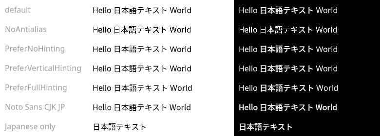
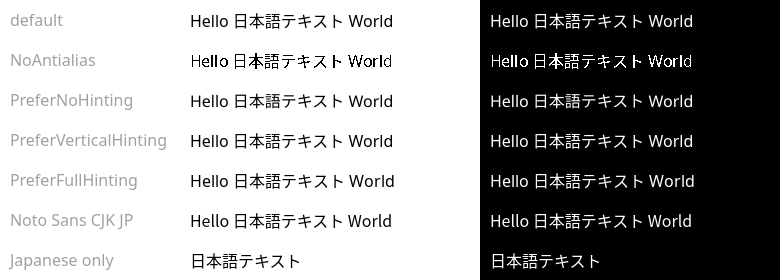

# font-test

Minimal samples for debugging inconsistent text weight with mixed Latin and
Japanese text: in Qt6, Japanese looks bolder than Latin when drawn as white
text on a black background.

## Samples

Each sample draws `Hello 日本語テキスト World` in Noto Sans 16px, once black on
white and once white on black, and writes a PNG. Japanese characters come from
font fallback (Noto Sans CJK JP).

| Program        | Rendering path                                     | Output             |
|----------------|----------------------------------------------------|--------------------|
| `cairo`        | pango + cairo image surface                        | `cairo.png`        |
| `gtk4`         | `GtkLabel` via GSK, rendered with the window's renderer | `gtk4.png`    |
| `qt6`          | `QPainter` on a `QImage`                           | `qt6.png`          |
| `qt6-variants` | Qt6 with several `QFont` variants, prints glyph runs | `qt6-variants.png` |

```sh
make
./cairo && ./gtk4 && ./qt6
./qt6-variants                      # default
./qt6-variants --no-stem-darkening  # writes qt6-variants-no-stem-darkening.png
```

`gtk4` briefly shows a window, since GTK only renders laid-out widgets.

Tested with Qt 6.11.2, GTK 4.22.5, cairo 1.18.6, pango 1.58.2,
FreeType 26.6.20, HarfBuzz 14.5.0 on Wayland without fractional scaling.

## Results

- `cairo.png`, `gtk4.png`: Latin and Japanese have consistent weight on both
  backgrounds.
- `qt6.png`: Japanese is noticeably bolder on the black background only.

| cairo | GTK4 | Qt6 |
|-------|------|-----|
|  |  |  |

`qt6-variants` (light-on-dark column):




| Variant                                         | Japanese bolder on dark? |
|-------------------------------------------------|--------------------------|
| default                                         | yes                      |
| `QFont::NoAntialias`                            | no                       |
| `PreferNoHinting` / `PreferVerticalHinting` / `PreferFullHinting` | yes, no visible change |
| `Noto Sans CJK JP` for the whole string         | yes, Latin also bolder   |
| Japanese only                                   | yes                      |

Glyph runs show Qt resolves the Japanese to `Noto Sans CJK JP` Regular,
weight 400, so the problem is not font fallback picking a heavier face. It
follows the CJK font itself (Latin drawn with it is also bolder), only appears
with antialiasing, and is unaffected by hinting.

## Cause

Noto Sans CJK is a CFF (PostScript outline) font, while Noto Sans is TrueType.
Qt treats CFF fonts specially in `src/gui/text/freetype/qfontengine_ft.cpp`
(v6.11.2):

1. When creating its FreeType library, Qt re-enables CFF stem darkening, which
   FreeType disables by default:

   ```cpp
   // Freetype defaults to disabling stem-darkening on CFF, we re-enable it.
   FT_Bool no_darkening = false;
   FT_Property_Set(freetypeData->library, "cff", "no-stem-darkening", &no_darkening);
   ```

2. For fonts using a stem-darkening driver, `expectsGammaCorrectedBlending()`
   returns true, so the raster paint engine (`qpaintengine_raster.cpp`) blends
   those glyphs with gamma correction.

Gamma-corrected blending thins dark-on-light text, and stem darkening is meant
to compensate. For light-on-dark text, gamma-corrected blending already makes
glyphs heavier, and stem darkening thickens them further. TrueType fonts like
Noto Sans get neither, so in mixed text only the CFF-rendered Japanese looks
bold on dark backgrounds.

Confirmation: `qt6-variants --no-stem-darkening` sets `no-stem-darkening` on
Qt's FreeType library (via the exported but non-public `qt_getFreetype()`)
before any font loads. That disables both behaviours, and all dark rows then
match the Latin weight.



## Workarounds

- `FREETYPE_PROPERTIES=cff:no-stem-darkening=1` does **not** work: Qt
  overrides the property after `FT_Init_FreeType()`. Output is byte-identical
  with `=0`, `=1` and unset.
- Use a TrueType-flavored Japanese font (e.g. TTF builds of Noto Sans JP,
  IPAex, M+), which avoids both stem darkening and gamma-corrected blending.
- Report upstream: Qt applies stem darkening regardless of text color, though
  it only compensates for dark-on-light text.
